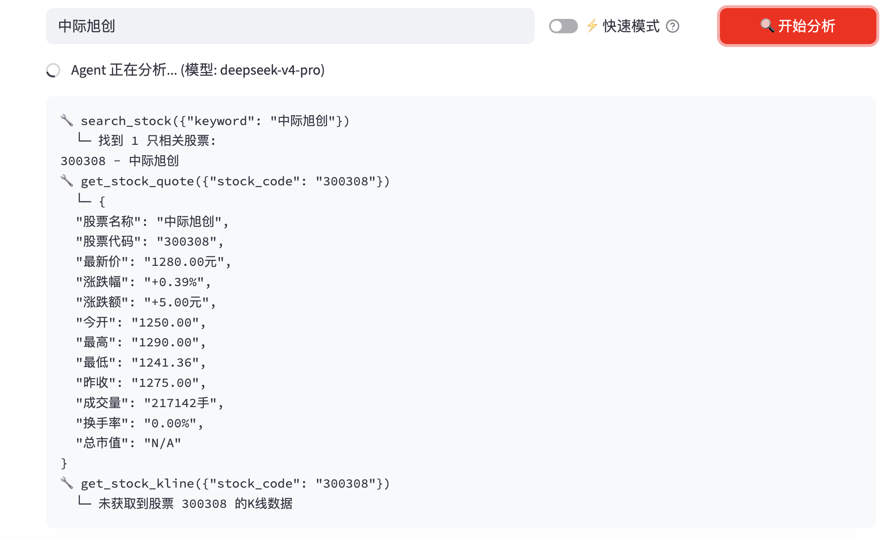

# 📊 金融研报 Agent · AI Finance Agent

[](https://python.org)
[](https://streamlit.io)
[](https://deepseek.com)
[](https://github.com/features/actions)
[](LICENSE)

**English** | [中文](#中文)

> An AI agent that autonomously analyzes 5,000+ Chinese A-shares and 10,000+ mutual funds, generating daily research reports pushed to WeChat — fully automated, zero operating cost.

## 🎬 Demo

<!-- TODO: 上传录屏到 YouTube/B站后替换下面链接 -->
> *Demo video coming soon*

**Try it yourself:**
```bash
pip install -r requirements.txt
streamlit run app.py
```

| Streamlit Web UI |
|:--:|
|  |

---

## 🧠 Core Feature: AI Agent with Autonomous Tool-Use

Unlike a regular chatbot, this system implements a **hand-written Agent Loop** (~50 lines) that autonomously decides which tools to call:

```
User: "分析宁德时代"
  → Agent calls search_stock("宁德") → gets 300750
  → Agent calls get_stock_quote("300750") → gets real-time price
  → Agent calls get_stock_kline("300750") → gets 30-day trend
  → Agent synthesizes all data → generates analysis report
```

**7 Built-in Tools**: search_stock · get_stock_quote · get_stock_kline · search_fund · get_fund_valuation · get_fund_nav_history · get_fund_info

---

## 🏗 Architecture

```
User Registers (Streamlit)
       │
       ▼
Google Sheets (user holdings DB)
       │
       ▼  cron: 10:00 & 14:30 BJT Mon-Fri
GitHub Actions ─→ Python Report Generator ─→ DeepSeek V4 AI
                                                   │
                                                   ▼
                                     ┌─ cc-connect → WeChat Bot (PC on)
                                     └─ Server酱 ──→ WeChat OA (fallback)
```

---

## 🛠 Tech Stack

| Layer | Tech | Why |
|------|------|-----|
| AI | DeepSeek V4 via Anthropic SDK | Hand-written Agent Loop, 7 tools |
| Data | Sina / EastMoney / TianTian Fund APIs | Free, covers all A-shares + funds |
| Storage | Google Sheets + gspread | $0, built-in Web UI, fallback to local JSON |
| Schedule | GitHub Actions cron | Free 2000 min/month, integrated with repo |
| Push | cc-connect (iLink Bot) + Server酱 | Dual-channel with auto-failover |
| Frontend | Streamlit | Python-native, zero frontend code |
| Cost | **¥0 / month** | Entirely free tier |

---

## 📁 Project Structure

```
finance-agent/
├── app.py                  # Streamlit web app (analysis + registration)
├── report_generator.py     # Report engine (cron entry point)
├── sheets_db.py            # Google Sheets data layer (with local fallback)
├── config.json             # Global config (watchlist, alert thresholds)
├── tests/                  # Unit tests (trading day detection, data parsing)
├── .github/workflows/      # GitHub Actions cron schedules
└── README.md
```

---

## 🚀 Quick Start

```bash
pip install -r requirements.txt
streamlit run app.py
```

Environment variables (for cron mode):
```bash
export ANTHROPIC_API_KEY=sk-xxx
export SERVERCHAN_SENDKEY=SCTxxx
export GOOGLE_SHEET_ID=1Mxxx
export GCP_SERVICE_ACCOUNT='{...}'
python report_generator.py morning
```

---

## 🔐 Security

- All secrets via GitHub Secrets / Streamlit Secrets — zero hardcoded keys
- Google Sheets Service Account with minimal permissions (editor only)
- `.gitignore` excludes all credential files and interview-prep docs

---

## 🔮 Future Roadmap

- [ ] Migrate Google Sheets → PostgreSQL for >100 users
- [ ] Add more data sources (bond market, crypto)
- [ ] Multi-language report support (EN/CN)
- [ ] Docker deployment
- [ ] Backtesting engine for strategy evaluation

---

## 📄 License

MIT

---

# 中文

## 📊 金融研报 Agent

> 覆盖全部 A 股（5000+）和公募基金（10000+）的 AI 智能分析工具。**核心是 Agent 自主决策**——不是简单的问答机器人。

## 🎬 演示

<!-- TODO: 录屏后替换 -->
> *Demo 视频制作中*

**快速体验：**
```bash
pip install -r requirements.txt
streamlit run app.py
```

## 🧠 Agent 核心能力

手写 Agent Loop（约 50 行），实现 **7 个 Tool-use 工具**，Agent 自主决定调用哪些工具、调用顺序、何时输出最终结果——无需人工编写 if-else。

## 🏗 系统架构

```
Streamlit 网页注册 → Google Sheets 存持仓
                         ↓
          GitHub Actions 定时触发（交易日 10:00 / 14:30）
                         ↓
          数据采集 → DeepSeek AI 分析 → 报告生成
                         ↓
          ┌─ cc-connect → 微信 Bot 好友（电脑在线）
          └─ Server酱 ──→ 公众号推送（兜底）
```

## 🛠 技术栈

| 层级 | 技术 |
|------|------|
| AI 模型 | DeepSeek V4（Anthropic 兼容 API） |
| 数据源 | 新浪财经 / 东方财富 / 天天基金 |
| 数据存储 | Google Sheets（零成本，支持本地回退） |
| 定时调度 | GitHub Actions（免费 cron） |
| 消息推送 | cc-connect (iLink Bot) + Server酱（双通道自动切换） |
| 前端 | Streamlit |
| 月度成本 | **¥0** |
